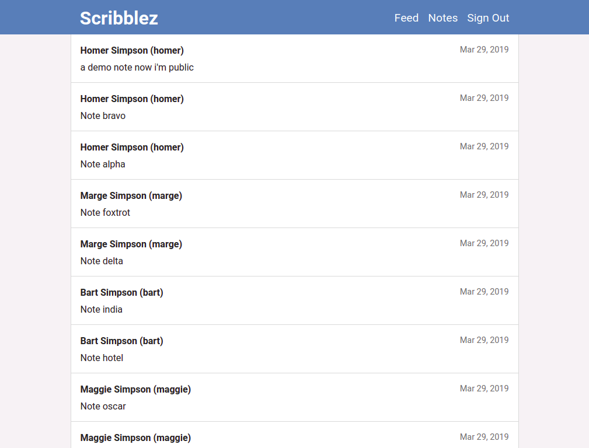
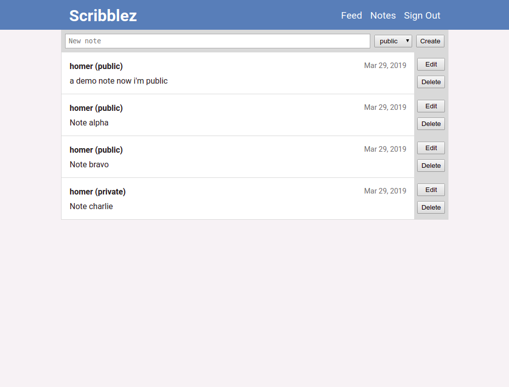

# Scribblez

[Live Demo](https://thebinarypenguin-scribblez-client.now.sh/)

## Summary

Scribblez is a note-sharing service that allows you to share your ideas with
the world. Don't like sharing? That's okay you can make your notes private. We
won't tell anyone.

## Screenshots

<figure>
    
    <figcaption>Public Feed</figcaption>
</figure>

<figure>
    
    <figcaption>Notes View</figcaption>
</figure>

## Stack

Scribblez uses the following technology

- [React](https://reactjs.org/) (for the font end)
- [Express](https://expressjs.com/) (for the back end)
- [PostgreSQL](https://www.postgresql.org/) (for data persistence)
- [JSON Web Tokens](https://tools.ietf.org/html/rfc7519) (for authentication)
